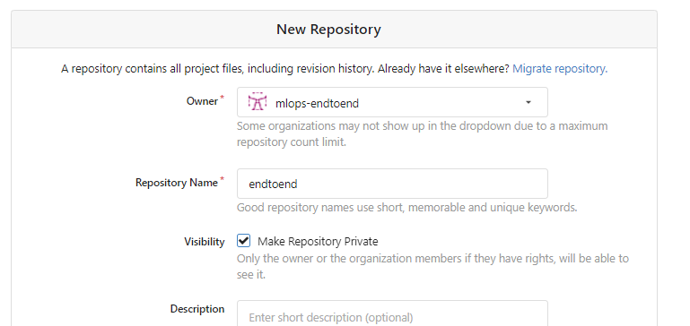
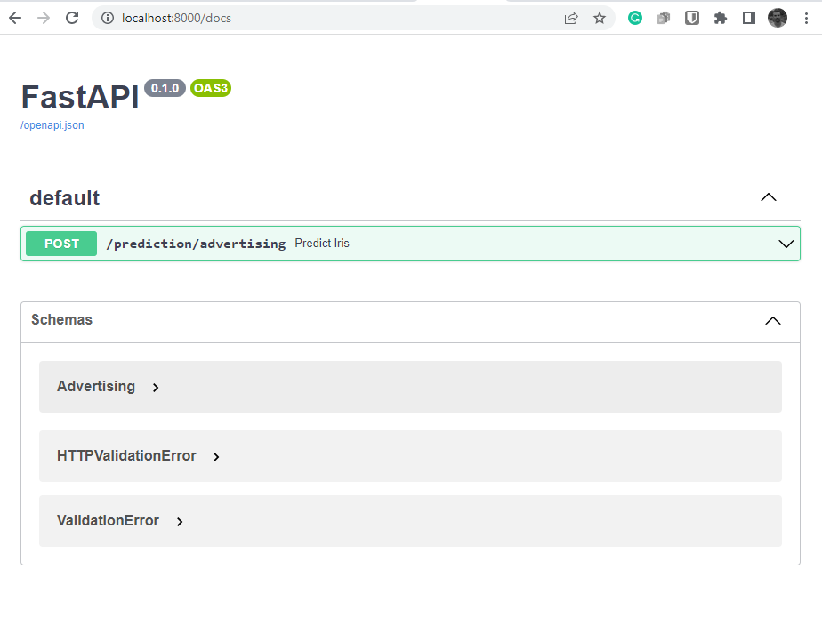

## 1. You have to finish note 19: CICD Jenkins notes

## 2. Create Gitea org and repo


---

```commandline
mkdir 20
cd 20/

touch README.md
git init

git add README.md
git commit -m "first commit"
git remote add origin http://localhost:3000/mlops-endtoend/endtoend.git
git push -u origin master
```

## 3. Jenkins Project
- Name: endtoend
- Type: Organization Folder
- Projects: Gitea Organization
- Credentials: jenkins (gitea user credentials)
- Owner: mlops-endtoend
- Discover branches: All branches
## 4. Open project with Pycharm (Windows)

## 5. Commit and push to Gitea

## 6. Observe on Jenkins

## 7. Test FastAPI
- Prod: http://localhost:8000/docs
- Test: http://localhost:8001/docs



----------------
